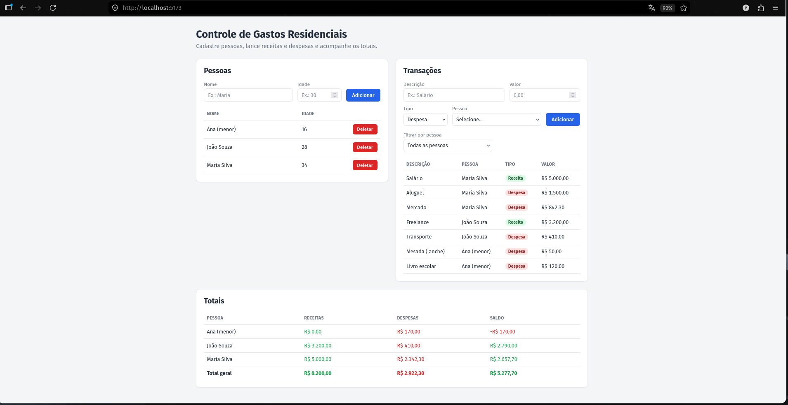

# Controle de Gastos Residenciais

[](https://github.com/pehenriqueoliv/ExpenseTracker/actions/workflows/ci.yml)

Sistema para controlar gastos de uma residência: cadastro de **pessoas**,
lançamento de **transações** (receitas e despesas) e **consulta de totais**
por pessoa e geral.

> O código (classes, métodos, endpoints) está em inglês; a interface e as
> mensagens ao usuário estão em português.

Monorepo com duas partes:

```
/backend   -> API .NET 10 (ASP.NET Core Web API + EF Core + SQLite)
/frontend  -> App React + TypeScript (Vite)
```

## Interface



---

## Back-end (`/backend`)

### Stack
- **ASP.NET Core Web API** em C# (.NET 10 LTS)
- **Entity Framework Core** + **SQLite** (banco em arquivo `expensetracker.db`)
- **Swagger/OpenAPI** para testar a API pelo navegador

### Pré-requisitos
- **.NET SDK 10** e o **runtime do ASP.NET Core 10** instalados.
  - Confira com: `dotnet --list-runtimes` (precisa aparecer `Microsoft.AspNetCore.App 10.x`)

### Como rodar

```bash
cd backend/ExpenseTracker.Api
dotnet run
```

Ao subir, a aplicação **aplica as migrations automaticamente** e cria o arquivo
`expensetracker.db` na primeira execução. Não é preciso configurar banco nenhum.

O perfil de execução já fixa a porta em `http://localhost:5000` (a mesma que o
front-end espera). Se quiser garantir explicitamente:

```bash
ASPNETCORE_URLS="http://localhost:5000" ASPNETCORE_ENVIRONMENT=Development dotnet run
```

- **Swagger UI:** http://localhost:5000/swagger
- **Base da API:** http://localhost:5000/api

### Endpoints

| Método | Rota                        | Descrição                                               |
|--------|-----------------------------|---------------------------------------------------------|
| POST   | `/api/people`               | Cria uma pessoa                                         |
| GET    | `/api/people`               | Lista as pessoas                                        |
| DELETE | `/api/people/{id}`          | Deleta a pessoa e, em cascata, todas as transações dela |
| POST   | `/api/transactions`         | Cria uma transação (Expense ou Income)                 |
| GET    | `/api/transactions`         | Lista as transações                                    |
| GET    | `/api/totals`               | Totais por pessoa + total geral                        |

### Regras de negócio
1. **Cascade delete:** ao deletar uma pessoa, todas as transações dela são
   apagadas (configurado no EF Core / banco).
2. **Transação:** só é possível criar e listar (não há editar/deletar). Ao criar:
   - O `personId` informado **deve existir**; senão retorna **404**.
   - Se a pessoa for **menor de 18 anos**, só pode cadastrar **Despesa** (`Expense`).
     Tentar cadastrar **Receita** (`Income`) para menor retorna **400** (regra de negócio).
3. **Totais:** retorna, para cada pessoa, total de receitas, total de despesas e
   saldo (receitas − despesas); e ao final o total geral consolidado.

Erros seguem o formato **Problem Details (RFC 7807)**.

### Estrutura das camadas

```
backend/ExpenseTracker.Api/
├── Entities/        # Modelos de domínio (Person, Transaction, enum TransactionType)
├── Data/            # AppDbContext (mapeamento EF Core, cascade delete)
├── Dtos/            # Records de request/response (com Data Annotations)
├── Services/        # Regras de negócio (Person, Transaction, Totals)
├── Exceptions/      # Exceções de domínio + GlobalExceptionHandler (Problem Details)
├── Controllers/     # Controllers finos (delegam aos Services)
├── Migrations/      # Migrations do EF Core
└── Program.cs       # Composição: DI, EF+SQLite, CORS, Swagger, pipeline HTTP
```

### Exemplos rápidos (curl)

```bash
# Criar pessoa
curl -X POST http://localhost:5000/api/people \
  -H "Content-Type: application/json" \
  -d '{"name":"Maria","age":30}'

# Criar transação (type: "Expense" ou "Income")
curl -X POST http://localhost:5000/api/transactions \
  -H "Content-Type: application/json" \
  -d '{"description":"Salario","amount":5000.00,"type":"Income","personId":"<GUID_DA_PESSOA>"}'

# Consultar totais
curl http://localhost:5000/api/totals
```

### Testes

Testes em **xUnit** (`backend/ExpenseTracker.Tests`), rodando contra um banco
**SQLite em memória** (para exercitar o comportamento relacional real, como o
cascade delete):

```bash
cd backend
dotnet test
```

- **Testes de unidade** da camada de serviço: cadastro/listagem/cascade delete
  de pessoa, a regra de menor de idade não poder cadastrar Receita, `personId`
  inexistente, validação do tipo da transação, e o cálculo dos totais por pessoa
  e geral.
- **Testes de integração** (`WebApplicationFactory`) exercitando o pipeline HTTP
  de ponta a ponta: o **400** automático quando o campo `type` é omitido (validação
  do `[ApiController]`) e o **400** da regra de negócio ao lançar Receita para um
  menor, retornado em Problem Details.

---

## Front-end (`/frontend`)

### Stack
- **React + TypeScript** com **Vite**
- **CSS puro** (sem framework de UI)
- Client de API tipado que espelha os DTOs do back-end

### Pré-requisitos
- **Node.js 20+** e **npm**

### Como rodar

Com o **back-end rodando** (em `http://localhost:5000`), em outro terminal:

```bash
cd frontend
npm install     # apenas na primeira vez
npm run dev
```

Abra **http://localhost:5173**.

> A URL da API pode ser configurada pela variável de ambiente `VITE_API_URL`
> (padrão: `http://localhost:5000/api`). Para usar outra, crie um arquivo
> `frontend/.env` com `VITE_API_URL=http://localhost:5000/api`.

### O que a tela faz
- **Pessoas:** formulário de cadastro (nome + idade) e listagem com botão de
  deletar (que remove também as transações da pessoa, via cascade no back-end).
- **Transações:** formulário com **dropdown de pessoa** e **dropdown de tipo**
  (Despesa/Receita), mais descrição e valor; e a listagem das transações.
- **Totais:** tabela com receitas, despesas e saldo por pessoa, e o total geral.
- **Erros da API** são exibidos em destaque — por exemplo, ao tentar cadastrar
  uma **Receita para um menor de 18 anos**, aparece a mensagem retornada pela API.

### Estrutura

```
frontend/src/
├── api/
│   ├── types.ts     # Tipos TypeScript espelhando os DTOs do back-end
│   └── client.ts    # Client de fetch tipado + extração de erros (Problem Details)
├── components/
│   ├── PeopleSection.tsx
│   ├── TransactionsSection.tsx
│   └── TotalsSection.tsx
├── utils/format.ts  # Formatação de moeda (R$)
├── App.tsx          # Layout e estado compartilhado entre as seções
└── App.css / index.css
```

---

## Decisões de arquitetura

O *porquê* das principais escolhas do projeto:

- **Arquitetura em camadas (Controllers finos → Services → EF Core).** Os
  controllers apenas recebem a requisição e delegam; toda a regra de negócio vive
  nos *Services*. Isso mantém o HTTP separado do domínio e permite testar as
  regras sem subir a aplicação (é o que os testes de unidade fazem).

- **Validação em dois níveis.** Validação de *formato* (campos obrigatórios,
  faixas) fica nos DTOs via *Data Annotations*, gerando **400** automático pelo
  `[ApiController]`. Regras de *domínio* (pessoa deve existir, menor só cadastra
  Despesa) ficam nos *Services* e lançam exceções de domínio. São
  responsabilidades diferentes, em lugares diferentes.

- **Tratamento de erros centralizado com `IExceptionHandler` + Problem Details
  (RFC 7807).** Um único handler traduz exceções de domínio em respostas HTTP
  padronizadas, deixando os controllers livres de `try/catch`. Mensagens de
  domínio (404/400) são expostas ao usuário; erros inesperados retornam uma
  mensagem genérica (para não vazar detalhes internos) e são registrados via
  `ILogger`.

- **EF Core + SQLite com migrations automáticas no startup.** Banco em arquivo,
  sem servidor para configurar: a aplicação cria o schema na primeira execução e
  roda de primeira. Simples e adequado ao escopo do desafio.

- **`decimal` (precisão 18,2) para valores monetários.** Evita os erros de
  arredondamento de ponto flutuante (`double`) em dinheiro.

- **Enum `TransactionType` serializado como texto** ("Expense"/"Income") tanto no
  JSON quanto no banco, mantendo os dados legíveis.

- **Totais somados em memória.** O SQLite não tem `SUM` nativo de `decimal`;
  somar na aplicação evita limitações de tradução para SQL e problemas de
  precisão. Seguro para o volume de dados desta aplicação.

- **Cascade delete no nível do banco.** A integridade referencial (apagar as
  transações junto com a pessoa) é garantida pelo mapeamento do EF Core, sem
  lógica manual de exclusão.

- **Front-end com client de API tipado espelhando os DTOs.** Dá um contrato
  verificado em tempo de compilação: qualquer divergência de campo é apontada
  pelo compilador. As mensagens de erro do Problem Details são extraídas e
  exibidas ao usuário.

- **Estado compartilhado simples no `App`** (com um contador de versão para
  sincronizar as seções) em vez de uma store global — proporcional ao tamanho da
  aplicação, sem dependências extras.

- **CORS restrito às origens locais do front-end**, em vez de liberar tudo.
